# Minecraft Server Documentation
## Initial Setup
<ol>
  <li>Install the <a href="https://modrinth.com/app">Modrinth</a> launcher.</li>
  <li>
    

      
Install <a href="https://modrinth.com/modpack/fabulously-optimized?version=1.21.5#download">Fabulously Optimized</a> in Modrinth and launch Minecraft through it (Fabric v1.21.5).

      <ul>
        <li><b>Fabulously Optimized</b> is a modpack whose name speaks for itself; It can 10x your FPS, mine went from ~150 to sometimes 1300+ fps.</li>
        <li>See FPS in image below:</li>
        <li></li>
      </ul>
    

  </li>
  <li>Install prerequisite client-side mods to your Fabulously Optimized instance in Modrinth:
    <ul>
      <li><a href="https://modrinth.com/mod/easy-magic?version=1.21.5&loader=fabric">Easy Magic</a></li>
      <li><a href="https://modrinth.com/mod/toms-storage?version=1.21.5&loader=fabric#download">Tom's Simple Storage</a></li>
    </ul>
  </li>
</ol>

## Server Commands/Info

  
<b>EssentialCommands - Command List</b>

  <h4>Commands</h4>
  
All of these commands support automatic tab completion using Minecraft's new commands system.

  
See the <a href="https://github.com/John-Paul-R/Essential-Commands/wiki/List-of-Commands-&-Permissions">full List of Commands &amp; Permissions</a>.

  <h5>Spawn</h5>
  <ul>
    <li><code>/spawn</code></li>
    <li><code>/spawn set</code></li>
  </ul>
  <h5>Teleport requests</h5>
  <ul>
    <li><code>/tpa &lt;target-player&gt;</code></li>
    <li><code>/tpahere &lt;target-player&gt;</code></li>
    <li><code>/tpaccept &lt;target-player&gt;</code></li>
    <li><code>/tpdeny &lt;target-player&gt;</code></li>
  </ul>
  <h5>Player Homes</h5>
  <ul>
    <li><code>/home set &lt;home-name&gt;</code></li>
    <li><code>/home tp &lt;home-name&gt;</code></li>
    <li><code>/home delete &lt;home-name&gt;</code></li>
    <li><code>/home list</code></li>
  </ul>
  <h5>Warps</h5>
  <ul>
    <li><code>/warp set &lt;warp-name&gt;</code></li>
    <li><code>/warp tp &lt;warp-name&gt;</code></li>
    <li><code>/warp delete &lt;warp-name&gt;</code></li>
    <li><code>/warp list</code></li>
  </ul>
  
Want to teleport to where you died? Enable <code>allow_back_on_death</code> in the <a href="https://github.com/John-Paul-R/Essential-Commands/wiki/Config-Documentation">config</a>.

  <h5>Nickname</h5>
  <ul>
    <li><code>/nickname set &lt;nickname&gt;</code></li>
    <li><code>/nickname clear</code></li>
    <li><code>/nickname reveal &lt;nickname&gt;</code></li>
  </ul>
  <h5>Random Teleport (/wild equivalent)</h5>
  <ul>
    <li><code>/randomteleport</code></li>
    <li><code>/rtp</code></li>
  </ul>
  <h5>Workbench</h5>
  <ul>
    <li><code>/workbench</code></li>
    <li><code>/anvil</code></li>
    <li><code>/enderchest</code></li>
    <li><code>/stonecutter</code></li>
    <li><code>/grindstone</code></li>
    <li><code>/wastebin</code></li>
  </ul>
  <h5>Kitchen sink</h5>
  <ul>
    <li><code>/afk</code></li>
    <li><code>/fly</code></li>
    <li><code>/fly &lt;target-player&gt;</code></li>
    <li><code>/invuln</code></li>
    <li><code>/invuln &lt;target-player&gt;</code></li>
    <li><code>/top</code></li>
    <li><code>/day</code></li>
    <li><code>/gametime</code></li>
  </ul>
  <h5>Config</h5>
  <ul>
    <li><code>/essentialcommands config reload</code></li>
  </ul>

  
<b>Get Off My Lawn Recipes and Augments</b>

  <h4>Claim Anchors</h4>
  
Craft a Claim Anchor to 'claim' an area.

  

  <h5>Makeshift Claim Anchor (Default radius: 10)</h5>
  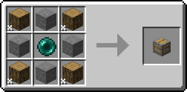

  <h5>Reinforced Claim Anchor (Default radius: 25)</h5>
  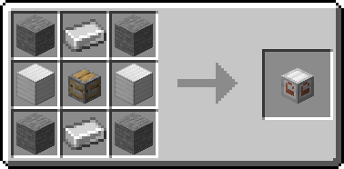
  <h6>Upgrade</h6>
  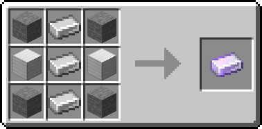

  <h5>Glistening Claim Anchor (Default radius: 50)</h5>
  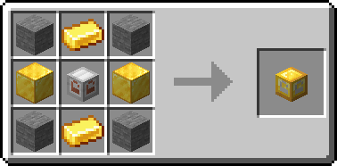
  <h6>Upgrade</h6>
  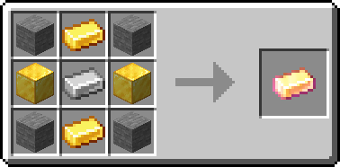

  <h5>Crystal Claim Anchor (Default radius: 75)</h5>
  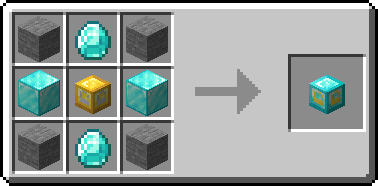
  <h6>Upgrade</h6>
  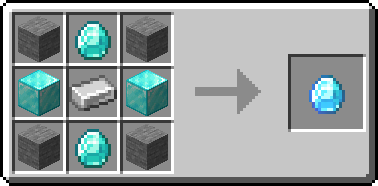

  <h5>Emeradic Claim Anchor (Default radius: 125)</h5>
  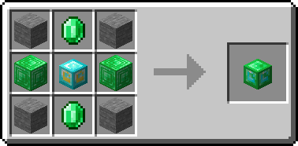
  <h6>Upgrade</h6>
  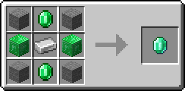

  <h5>Withered Claim Anchor (Default radius: 200)</h5>
  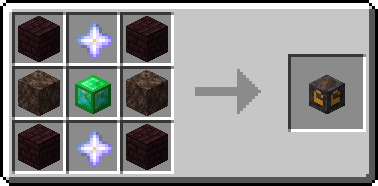
  <h6>Upgrade</h6>
  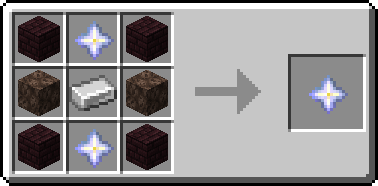

  <h4>Claim Augments</h4>
  
To upgrade your claim, place an Anchor Augment next to the core Claim Anchor.

  <h5>Angelic Aura (Grants regeneration to all players inside the region.)</h5>
  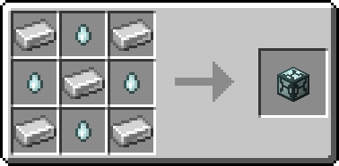

  <h5>Chaos Zone (Gives strength to all players inside the region.)</h5>
  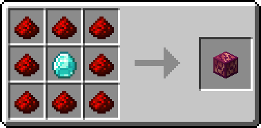

  <h5>Ender Binding (Prevents Endermen from teleporting.)</h5>
  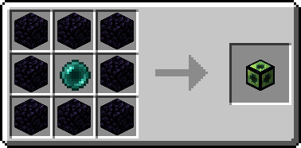

  <h5>Explosion Controller (Allows toggling explosion protection within the claim.)</h5>
  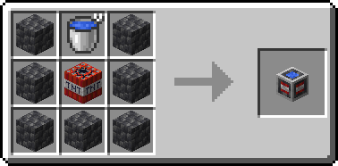

  <h5>Force Field (Launches non-whitelisted players out of the claim.)</h5>
  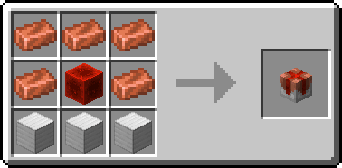

  <h5>Greeter (Displays a message of the day (MOTD) to visitors.)</h5>
  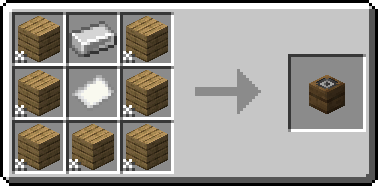

  <h5>Heaven Wings (Grants flight within the claim.)</h5>
  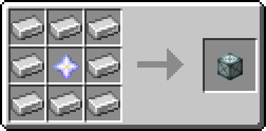

  <h5>Lake Spirit's Grace (Grants water breathing, improved underwater vision, and better underwater movement.)</h5>
  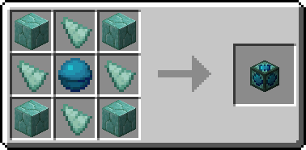

  <h5>PvP Arena (Allows changing the PvP state within the claim.)</h5>
  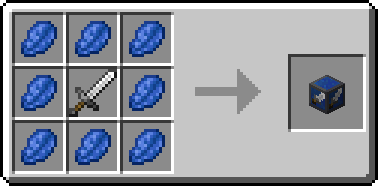

  <h5>Village Core (Prevents zombies from damaging villagers.)</h5>
  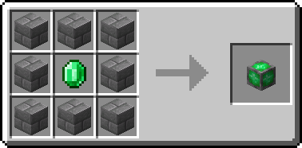

  <h5>Withering Seal (Prevents the wither status effect inside the region.)</h5>
  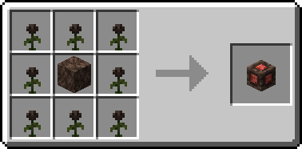

  <h4>Others</h4>

  <h5>Goggles of (Claim) Revealing (Reveals claim outlines when equipped in helmet, mainhand, or offhand.)</h5>
  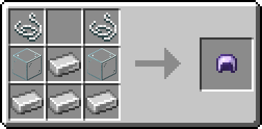

  
Info sourced from <a href="https://github.com/Patbox/get-off-my-lawn-reserved/blob/1.21.5/README.md">GitHub README</a>.

  
<b>Hey That's Mine Commands and Config</b>

  <h4>Using HTM</h4>
  
The mod has multiple commands which you can use on your containers

  <h5>Flag</h5>
  
<code>/htm flag</code>: Checks the flags of a specific container. Left click on the container after running this command to check

  
<code>/htm flag &lt;type&gt; &lt;value&gt;</code>: Left click a container to set the flag

  
Permission node: <code>htm.command.flag</code>

  <h5>Set</h5>
  
<code>/htm set PUBLIC</code>: Allows everyone to access the container

  
<code>/htm set PRIVATE</code>: Allows only the owner and those with permissions to access the container

  
<code>/htm set KEY</code>: Allows only those with a key to access the container

  
Permission node: <code>htm.command.set</code>

  <h5>Trust</h5>
  
<code>/htm trust &lt;player&gt; [global]</code>: Allows a player to access that container if private

  
Permission node: <code>htm.command.trust</code>

  <h5>Untrust</h5>
  
<code>/htm untrust &lt;player&gt; [global]</code>: Revokes a player's access to the container

  
Permission node: <code>htm.command.trust</code>

  <h5>Remove</h5>
  
<code>/htm remove</code>: Removes all protections from a container

  
Permission node: <code>htm.command.remove</code>

  <h5>Transfer</h5>
  
<code>/htm transfer &lt;player&gt;</code>: Transfers ownership to another player

  
Permission node: <code>htm.command.transfer</code>

  <h5>Persist</h5>
  
Toggles persist mode, which allows you to continue executing the same action without typing the command again

  
<code>/htm persist</code>

  
Permission node: <code>htm.command.persist</code>

  <h5>Quiet</h5>
  
Toggles no message mode, which hides non-command messages like automatic protection creation and override.

  
<code>/htm quiet</code>

  
Permission node: <code>htm.command.quiet</code>

  <h5>Config</h5>
  
<code>canTrustedPlayersBreakChests</code>: Toggles whether players trusted to a locked container can break the container (set to false by default meaning only the owner can break a locked container).

  
<code>defaultFlags</code>:

  <ul>
    <li><code>hoppers</code>: Toggles whether hoppers can pull from locked containers by default (true by default meaning hoppers can pull from locked containers).</li>
  </ul>
  
<code>autolockingContainers</code>: List of containers which will be set to PRIVATE by default (remove items in the list to make them set to public by default).

  <h5>Additional permissions</h5>
  
<code>htm.admin</code>: Allows unrestricted access to containers and other managerial permissions

  
Info sourced from <a href="https://github.com/QuiltServerTools/HeyThatsMine/blob/master/README.md">GitHub README</a>.

  
<b>Neo Enchant+ Enchantments List</b>

  <ul>
    <li>
      <strong>Armor</strong>:
      <ul>
        <li><strong>Fury</strong>: Decreases armor in percent and grants armor penetration and increased damage percentage on your hits.</li>
        <li><strong>Life+</strong>: Gives the player extra hearts.</li>
        <li><strong>Venom Protection</strong>: Provides protection against negative effects.</li>
      </ul>
    </li>
    <li>
      <strong>Helmet</strong>:
      <ul>
        <li><strong>Bright Vision</strong>: Gives night vision to the player.</li>
        <li><strong>Auto-Feed</strong>: Automatically feeds you every minute.</li>
        <li><strong>Voidless</strong>: If you fall into the void, you briefly gain a levitation effect.</li>
      </ul>
    </li>
    <li>
      <strong>Chestplate</strong>:
      <ul>
        <li><strong>Builder Arms</strong>: Allows you to place and break blocks from a longer distance.</li>
      </ul>
    </li>
    <li>
      <strong>Leggings</strong>:
      <ul>
        <li><strong>Fast Swim</strong>: Grants the player a dolphin Grace effect.</li>
        <li><strong>Leaping</strong>: Boosts the player.</li>
        <li><strong>Oversize</strong>: Increase entity size.</li>
        <li><strong>Dwarfed</strong>: Decrease entity size.</li>
      </ul>
    </li>
    <li>
      <strong>Boots</strong>:
      <ul>
        <li><strong>Step Assist</strong>: Allows you to walk up blocks more easily.</li>
        <li><strong>SkyWalk</strong>: Allows you to fly if there is a 4 blocks gap below your feet. To descend just crouch.</li>
        <li><strong>Lava Walker</strong>: Allows the player to walk on lava.</li>
        <li><strong>Agility</strong>: Increases player speed.</li>
      </ul>
    </li>
    <li>
      <strong>Elytra</strong>:
      <ul>
        <li><strong>Armored</strong>: For elytra, reduce the damage taken.</li>
      </ul>
    </li>
    <li>
      <strong>Sword</strong>:
      <ul>
        <li><strong>Reach</strong>: Increase the range of your attack.</li>
        <li><strong>XpBoost</strong>: Gain additional experience from killing mobs.</li>
        <li><strong>Life Steal</strong>: Drains health from the target and transfers it to the player.</li>
        <li><strong>Poison Aspect</strong>: Poisons the mob upon hitting it.</li>
        <li><strong>Fear</strong>: When you hit a creeper, it delays their explosion by 12.5 seconds.</li>
        <li><strong>Pull</strong>: Allows you to retrieve a mob egg with a small probability when you kill a monster.</li>
      </ul>
    </li>
    <li>
      <strong>Mace</strong>:
      <ul>
        <li><strong>Striker</strong>: With maces, you have a small chance to summon thunder. If the weather is stormy, the thunder will strike the mob at each hit and work also on lighting rod. Also you are immune to thunder damage.</li>
        <li><strong>Wind Propulsion</strong>: When you strike your mace on the ground, you cause an explosion that sends you into the air, designed to be used in combination with "Wind Burst".</li>
      </ul>
    </li>
    <li>
      <strong>Tools</strong>:
      <ul>
        <li><strong>Auto-Smelt</strong>: Automatically smelts items.</li>
      </ul>
    </li>
    <li>
      <strong>Axe</strong>:
      <ul>
        <li><strong>Timber</strong>: Cut down a tree with one strike.</li>
      </ul>
    </li>
    <li>
      <strong>Pickaxe</strong>:
      <ul>
        <li><strong>Bedrock Breaker</strong>: Allows you to break bedrock, but consumes 200 durability per block.</li>
        <li><strong>VeinMiner</strong>: If you break a mineral block, all surrounding minerals also break.</li>
        <li><strong>Spawner Touch</strong>: Allows your pickaxe to retrieve spawners.</li>
      </ul>
    </li>
    <li>
      <strong>Hoe</strong>:
      <ul>
        <li><strong>Scyther</strong>: Allows you to transform dirt in farmland in x by z surface depending on enchantment levels.</li>
      </ul>
    </li>
    <li>
      <strong>Bow</strong>:
      <ul>
        <li><strong>Explosive Arrow</strong>: When arrows hit blocks, they create an explosion, and entities take damage.</li>
        <li><strong>Accuracy Shot</strong>: Arrows fly straight.</li>
        <li><strong>Breezing Arrow</strong>: (Bow and Crossbow) Causes a repulsion effect and sends the hit target into the air. If arrows miss, it causes a repulsion effect on the ground.</li>
      </ul>
    </li>
  </ul>
  
Info sourced from <a href="https://github.com/Hardel-DW/NeoEnchant/blob/main/README.md">GitHub README</a>.

</li>

  
<b>Tom's Simple Storage Tips</b>

  <h4>Resources</h4>
  

    - Short YT guide <a href="https://youtu.be/nW5ElcWiC3c" target="_blank">here</a> 
    - Recipes <a href="https://github.com/tom5454/Toms-Storage/tree/master/NeoForge/src/platform-shared/resources/data/toms_storage/recipe" target="_blank">here</a>.
  

  <h4>Rules</h4>
  
<strong>Rules</strong>

  <ol>
    <li>Inventory Hoppers must be connected to chests; can be going down or sideways.</li>
    <li>After the Hopper, have an Inventory Connector.</li>
    <li>Cannot have two hoppers on one chest.</li>
  </ol>

<li><b>InventorySorter</b> has a client-side mod available <a href="https://modrinth.com/mod/inventory-sorting?version=1.21.5">here</a>, but if you don't want it you can sort chests by double-clicking empty tiles.</li>

<li><b>Better Than Mending</b>: Crouch and right-click to use XP to repair a tool/weapon with mending.</li>

## Optional Installs
### Mods
<ul>
  <li>
    

      
<a href="https://modrinth.com/plugin/simple-voice-chat">Simple Voice Chat</a> - You won't be able to use proximity voice chat without this.

      <ul>
        <li>Try downloading it with the Modrith client first, but it's likely you won't be able to add it to your <b>"Fabulously Optimized"</b> instance.</li>
        <li>To download it manually, use <a href="https://modrinth.com/plugin/simple-voice-chat?version=1.21.5&loader=fabric">this link</a>.</li>
        <li>Then, place it inside your <b>"Fabulously Optimized"</b> instance's mod folder.</li>
        <ul>
          <li>(Windows) <code>%APPDATA%\ModrinthApp\profiles\Fabulously Optimized\mods</code></li>
          <li>(Linux) <code>~/.local/share/ModrinthApp/profiles/Fabulously\ Optimized/mods</code></li>
        </ul>
        <li>Once you've loaded it in-game:</li>
        <ul>
          <li>Press <code>v</code> (default) to access SVC's settings, make sure you select the correct input and output devices.</li>
          <li>Type <code>/voicechat</code> to see it's commands (<code>/voicechat invite &lt;PLAYERNAME&gt;</code> is the most relevant).</li>
        </ul>
      </ul>
    

  </li>
  <li><a href="https://modrinth.com/mod/simplehud">Simple HUD</a> - Configurable Heads Up Display that shows game information.</li>
</ul>

### Resource Packs
<ul>
  <li><a href="https://modrinth.com/resourcepack/default-hd-128x/versions">Default HD 128x</a> (Not as potent as shaders, but barely impacts performance)</li>
  <li><a href="https://modrinth.com/resourcepack/dramatic-skys">Dramatic Skies</a></li>
</ul>

### Shaders
<ul>
  <li>
    

      
<a href="https://modrinth.com/shader/complementary-reimagined">Complementary Reimagined</a>

      <ul>
        <li>Sample images:
          <ul>
            <li></li>
            <li></li>
          </ul>
        </li>
      </ul>
    

  </li>
</ul>

## Known Issues
Nil

## Server-Side Mod List
- [Essential Commands](https://github.com/John-Paul-R/Essential-Commands/) - Provides essential server commands and utilities.
- [CT's Overhauled Villages](https://modrinth.com/mod/ct-overhaul-village) - Overhauls and improves village generation.
- [LuckPerms](https://modrinth.com/plugin/luckperms) - A powerful permissions management plugin.
- [Almanac](https://modrinth.com/mod/almanac) - Library mod used by other mods.
- [Roguelike Dungeons](https://modrinth.com/mod/roguelikedungeons) - Adds complex and challenging underground dungeons.
- [ScalableLux](https://modrinth.com/mod/scalablelux) - Adds more configurable light sources.
- [Actually Harvest](https://modrinth.com/mod/actually-harvest) - Allows right clicking crops to harvest.
- [Balm](https://modrinth.com/mod/balm) - Another library mod used by other mods.
- [Cristel Lib](https://modrinth.com/mod/cristel-l55) - A utility library for other mods.
- [Fabric API](https://modrinth.com/mod/fabric-api) - The core API for Fabric modding.
- [Get Off My Lawn](https://modrinth.com/mod/goml-reserved) - Adds land claiming mechanics.
- [Hey That's Mine](https://modrinth.com/mod/htm) - Prevents stealing of placed items.
- [Let Me Despawn](https://modrinth.com/plugin/lmd) - Controls mob despawning behavior.
- [Lithium](https://modrinth.com/mod/lithium) - General server-side optimization mod.
- [Lithostitched](https://modrinth.com/mod/lithostitched) - Optimizes chunk loading.
- [Nether Portal Fix](https://modrinth.com/mod/netherportalfix) - Fixes issues with Nether portal linking.
- [Tom's Simple Storage](https://modrinth.com/mod/toms-storage) - Allows for the unifying of chests and accessing them through a single interface.
- [Spark](https://modrinth.com/mod/spark) - A performance profiling tool.
- [Towns and Towers](https://modrinth.com/mod/towns-and-towers) - Generates new and improved structures.
- [Dungeons and Taverns](https://modrinth.com/datapack/dungeons-and-taverns)
- [Detect AFK](https://modrinth.com/datapack/detect-afk)
- [AFK sleep](https://modrinth.com/datapack/afk-sleep)
- [Forge conflict API Port](https://modrinth.com/mod/forge-config-api-port)
- [Easy Magic](https://modrinth.com/mod/easy-magic)
- [Puzzles Lib](https://modrinth.com/mod/puzzles-lib)
- [Cloth Config API](https://modrinth.com/mod/cloth-config)
- [Inventory Sorter](https://modrinth.com/mod/inventory-sorting)
- [Clumps XP](https://modrinth.com/mod/clumps)
- [Mine Spawners](https://modrinth.com/mod/mine-spawners)
- [Homing XP](https://modrinth.com/datapack/simple-homing-xp)
- [Mine Treasure](https://modrinth.com/datapack/mine-treasure)
- [Neo Enchant+](https://modrinth.com/datapack/neoenchant)
- [AFK Sit](https://modrinth.com/datapack/afk-sit)
- [Better Than Mending](https://modrinth.com/mod/better-than-mending)